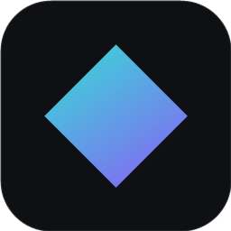

<div align="center">



# PrismDesk

**Low-latency Android screen mirroring &amp; control for Windows.**

Your Android, mirrored to Windows — sharp, smooth, and instant. Hardware-decoded on your
GPU and presented flip-model, so what you see is as close to real-time as Windows gets.

[**Website**](https://amrutgawade.github.io/PrismDesk/) ·
[**Download**](https://github.com/amrutgawade/PrismDesk/releases/latest) ·
[Report an issue](https://github.com/amrutgawade/PrismDesk/issues)


</div>

---

## Features

- **Instant USB mirror** — plug in, click **Start Mirror**, and your screen is live in a dedicated window. No accounts, no cloud.
- **Built for low latency** — present-on-arrival, drop-to-latest, and a frame-latency-1 swapchain so lag can never accumulate.
- **Full control** — mouse taps &amp; swipes, wheel scroll, right-click Back, and real keyboard input straight into the phone.
- **Device audio** — hear your phone through your PC, in sync, with a one-key mute.
- **Record &amp; snapshot** — MP4 recording with audio (Ctrl+R) and full-resolution PNG screenshots (Ctrl+S), or trigger both from the dashboard.
- **Two-way clipboard** — copy on the phone, paste on the PC, and back again.
- **Multiple devices** — mirror several phones at once, each in its own window with independent controls.
- **Auto-reconnect** — unplug, sleep, or wander off; the window stays put and resumes the moment it's back.
- **Quality presets** — Balanced, Crisp, or Low-latency, tuned per device and remembered across launches.
- **OBS-ready** — a real window OBS/Game Capture can grab. Premium dark &amp; light UI.

## Requirements

| | |
|---|---|
| **OS** | Windows 10 or 11, 64-bit |
| **GPU** | A GPU with dedicated video memory. NVIDIA is preferred and auto-selected (tested on **GTX 1650**); other discrete GPUs with hardware H.264 decode may work but are untested. |
| **Codecs** | H.264 decode is built into Windows. The **Crisp** preset uses H.265/HEVC — install *HEVC Video Extensions* from the Microsoft Store to use it, otherwise it falls back to H.264 automatically. |
| **Phone** | Android with **USB debugging** enabled, plus a USB cable. `adb` is bundled — nothing else to install. |
| **Runtimes** | None. The build is self-contained (no .NET or Visual C++ redistributables). |

## Download &amp; install

Grab the latest build from [**Releases**](https://github.com/amrutgawade/PrismDesk/releases/latest):

- **`PrismDesk-x.y.z-setup.exe`** — installer (per-user, no admin). Adds Start Menu + Desktop shortcuts and an uninstaller.
- **`PrismDesk-x.y.z-portable-win64.zip`** — portable. Unzip anywhere and run `PrismDesk.exe`.

> The build is currently **unsigned**, so on first launch Windows SmartScreen may say *"Unknown publisher."*
> Click **More info → Run anyway**.

Then: enable **USB debugging** on your phone (Settings → Developer options), connect it over USB,
accept the RSA prompt, and click **Start Mirror**.

## Controls

**In the mirror window**

| Input | Action |
|---|---|
| Left click / drag | Tap &amp; swipe |
| Mouse wheel | Scroll |
| Right click | Back |
| Type | Send text to the focused field |
| `F11` | Toggle borderless fullscreen |
| `Ctrl` + `M` | Mute / unmute device audio |
| `Ctrl` + `S` | Save a screenshot (PNG) |
| `Ctrl` + `R` | Start / stop recording (MP4) |
| `Ctrl` + `V` | Paste PC clipboard to the device |

Snapshots, recording and mute are also available as buttons on each device in the dashboard.
Screenshots are saved to `Pictures\PrismDesk`, recordings to `Videos\PrismDesk`.

## Under the hood

No FFmpeg, no jitter buffer, no browser in the middle — a tight native pipeline from the
phone's encoder to your monitor:

- **Hardware decode** — H.264/H.265 is decoded on the GPU via Media Foundation (NVDEC) straight to NV12 textures that never leave VRAM, then a BT.709 shader.
- **Zero-lag presentation** — a D3D11 flip-model waitable swapchain with maximum frame latency of 1, pinned to the discrete GPU and VRR-aware.
- **Direct USB transport** — a scrcpy-compatible reverse tunnel streams frames over USB with no jitter buffer.

Built in Rust with [`windows-rs`](https://github.com/microsoft/windows-rs) and
[`egui`](https://github.com/emilk/egui).

## Building from source

PrismDesk builds against a standalone **GNU** Rust toolchain (`x86_64-pc-windows-gnu`).
A small shim is vendored in `tools/gnu-shim/` to work around missing assembler/import-lib
tooling — regenerate it once with `tools/setup-gnu-shim.ps1`, then put it first on `PATH`:

```powershell
# from the repo root
$env:Path = "$PWD\tools\gnu-shim;$env:Path"
cargo build -p pd-engine --release
```

Package the distributables (portable + installer):

```powershell
powershell -File packaging\make-portable.ps1     # portable folder + zip
powershell -File packaging\make-installer.ps1    # + NSIS installer (needs makensis)
```

## Credits &amp; license

PrismDesk is licensed under the [MIT License](LICENSE).

It bundles or builds on these excellent projects:

| Component | License |
|---|---|
| [scrcpy](https://github.com/Genymobile/scrcpy) server (Genymobile) | Apache-2.0 |
| Android platform-tools / `adb` (Google) | Android SDK terms |
| [Geist &amp; Geist Mono](https://github.com/vercel/geist-font) fonts (Vercel) | OFL-1.1 |
| [Lucide](https://github.com/lucide-icons/lucide) icons | ISC |
| [egui / eframe](https://github.com/emilk/egui), [windows-rs](https://github.com/microsoft/windows-rs) | MIT / Apache-2.0 |

Not affiliated with Google or Genymobile.

---

Designed &amp; built by [**Amrut Gawade**](https://amrut.is-a.dev) ·
Support &amp; feature requests: [webdeveloper.amrut@gmail.com](mailto:webdeveloper.amrut@gmail.com) ·
[Buy me a coffee ☕](https://buymeacoffee.com/amrutgawade)
